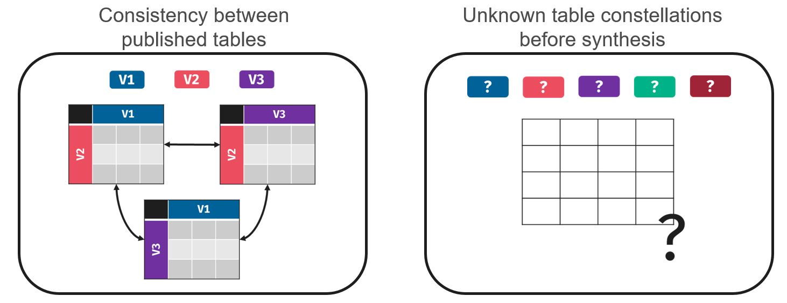
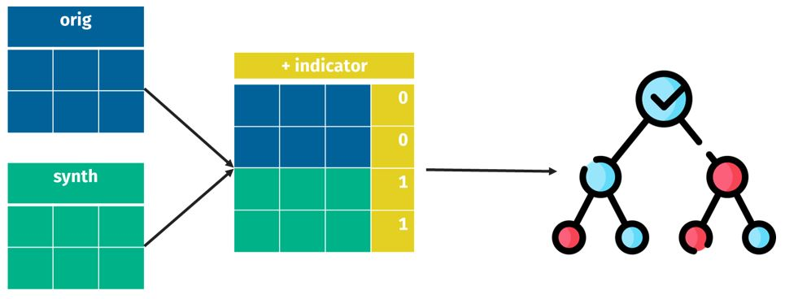
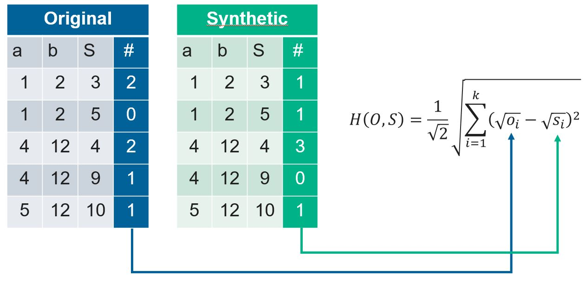

```{r}
#| label: setup
#| echo: false

# Load all needed packages, functions, datasets, etc.
de_root <- path.expand("~/WP13/DE")

required_pkgs <- c(
  "arules", "data.table", "dplyr", "foreach", "future", "future.apply",
  "kableExtra", "knitr", "reshape2", "rpart", "tibble", "tidyr"
)
missing_pkgs <- required_pkgs[
  !vapply(required_pkgs, requireNamespace, quietly = TRUE, FUN.VALUE = logical(1))
]
if (length(missing_pkgs) > 0) {
  stop("Missing required package(s): ", paste(missing_pkgs, collapse = ", "))
}
invisible(lapply(required_pkgs, require, character.only = TRUE))

source_files <- c(
  "functions/gu_micro.R",
  "functions/propensity_scores.R",
  "functions/pmse.R",
  "functions/specks.R",
  "functions/null_pmse_permutation.R",
  "functions/null_pmse_pairwise.R",
  "functions/key_target_auxiliary.R",
  "functions/hellinger_dt.R",
  "functions/n_way_tables.R",
  "functions/weap.R",
  "functions/tcap.R",
  "functions/tcap_ratio.R",
  "functions/tabular_risk_auxiliaries.R"
)
invisible(lapply(file.path(de_root, source_files), source))

data <- readRDS(file.path(de_root, "data/traffic_accidents_subset_10pct.rds"))
synth_data <- readRDS(file.path(de_root, "output/sds/sds_preds10_lv15.rds"))
```

```{r}
#| label: helper-functions
#| echo: false

style_args_table <- function(kable_obj) {
  kable_obj |>
    kable_styling(
      bootstrap_options = c("striped", "hover", "condensed"),
      full_width = TRUE,
      font_size = 12
    ) |>
    column_spec(1, bold = TRUE, width = "10em") |>
    column_spec(2, width = "40em")
}
```

# Introduction

## Data

This document demonstrates how to evaluate synthetic microdata with respect to
**utility** and **disclosure risk**, using a "real-world" microdata set as the basis.

It only shows how to use the utility and disclosure risk metrics for microdata and
tables.

To showcase this use case, we used a subset of the "Traffic Accidents" dataset from kaggle (<https://www.kaggle.com/datasets/oktayrdeki/traffic-accidents/data>).

The original data set contains `r nrow(data)` observations and
`r ncol(data)` variables. A glimpse of the structure:

```{r}
#| label: data-preview
#| echo: false

require(knitr)
require(kableExtra)

preview_data <- head(data, 3)

# Extract variable classes, formatted like tibble
col_classes <- sapply(preview_data, class)
col_classes <- paste0("<", col_classes, ">")

preview_data |>
  kable(format = "html", escape = FALSE) |>
  kable_styling(
    bootstrap_options = c("striped", "hover", "condensed"),
    full_width = TRUE,
    font_size = 12
  ) |>
  add_header_above(
    header = setNames(rep(1, ncol(preview_data)), col_classes),
    italic = TRUE,
    color = "gray"
  ) |>
  scroll_box(width = "100%")
```

## Background & Motivation

- Some variables in the original data have already been published via **frequency
  tables** and must remain unchanged (fixed marginals).
- For any variable used across multiple tables, **marginal counts must be
  consistent** across all published tables (see @fig-situation, left panel).
- Before synthesis, the various table constellations (includung which variables)
  is also unknown (see @fig-situation, right panel).
- To enable data sharing while preserving these constraints, we apply
  **partial synthesis**: sensitive variables are synthesised, while already-published   and non-sensitive variables are kept as-is.

```{r}
#| label: fig-situation
#| fig-cap: "Challenges of the presented use case."
#| out-width: "80%"
#| fig-align: "center"
#| echo: false


```

::: {.callout-important}
## Research question

Can utility and disclosure risk metrics computed on **synthetic microdata**
serve as reliable proxies for the corresponding metrics on
**synthetic frequency tables**?
:::

## Approach

1. Compute **utility** and **disclosure risk** metrics on the synthetic *microdata*
2. Compute **utility** and **disclosure risk** metrics on synthetic *frequency tables*
3. Assess the **correlation** between both sets of metrics (not shown in this script)

# Partial synthesis

Due to the case-specific nature of the synthesis process, the synthesis itself
is not demonstrated in this document. However, the full synthesis code is
available in the R project folder.

In brief, partial synthesis was carried out using the R package
[`synthpop`](https://cran.r-project.org/package=synthpop) with a
**CART synthesiser**. Only the following three variables were considered
sensitive and were therefore synthesised:

- `trafficway_type` (factor, 20 levels)
- `damage` (factor, 3 levels)
- `injuries_fatal` (numeric)

All remaining variables were kept as-is from the original data.
In total, **m = 5 synthetic data sets** were generated.

# Utility evaluation

## Utility on microdata level

### Propensity Score Mean Squarred Error (pMSE)

- The pMSE is a general utility measure that assesses how
  distinguishable the synthetic data is from the original data
- Combined data set is created by stacking the original and synthetic records,
- and a propensity score model (here: CART) is trained to classify whether each
  record belongs to the original or synthetic data (see @fig-ps)
- **Lower values indicate higher utility.**

```{r}
#| label: fig-ps
#| fig-cap: "Schematic representation for calculating propensity scores"
#| out-width: "80%"
#| fig-align: "center"
#| echo: false


```

### pMSE Ratio

- pMSE ratio adjusts for the dependence of the raw pMSE on the complexity of the
  propensity model by expressing the observed pMSE relative to its expected
  value under correct synthesis (CS)
- CS: scenario in which original and synthetic records are exchangeable draws
  from the same underlying distribution
- pMSE ratio = 1 represents this ideal baseline
- Since a CART model is used, the number of fitted parameters is unknown and the
  null expectation must be approximated via resampling — two methods are available
  (Snoke et al., 2018):
  - **Permutation:** permutes the original/synthetic indicator repeatedly and
    recomputes the pMSE; suitable only when **all** variables are synthesised
  - **Pairwise:** computes the pMSE between pairs of synthetic data sets; required
    for **partial synthesis** and assumes $m \geq 2$ synthetic data sets

### SPECKS

- SPECKS is derived from the **Kolmogorov-Smirnov statistic** applied to the
predicted propensity score distributions of original and synthetic records
- Values close to **0 indicate high utility**, meaning the synthetic data is
  hard to distinguish from the original

### Code example

```{r}
#| label: tbl-args-umicro
#| tbl-cap: "Arguments of the `gu_micro()` function."
#| echo: false

require(knitr)
require(kableExtra)

args_table <- data.frame(
  Argument = c(
    "`ods`",
    "`sds`",
    "`resampling`",
    "`future_plan`",
    "`workers`",
    "`ignore_na`",
    "`rpart_control`",
    "`future.seed`",
    "`future.packages`",
    "`nperms`",
    "`...`"
  ),
  Description = c(
    "Original data set (`data.frame`).",
    "List of synthetic data set(s).",
    "Resampling method to approximate the null expectation for the pMSE ratio. Choose between `\"permutation\"` and `\"pairwise\"` (see also `synthpop::utility.gen`, argument `resamp.method`).",
    "Parallelisation strategy passed to `future::plan()`.",
    "Number of CPU cores used for parallelisation via the `future` package.",
    "If `TRUE`, rows with missing values are omitted prior to propensity score estimation.",
    "Control parameters for the CART propensity model, passed to `rpart::rpart.control()` (e.g. `rpart.control(cp = 1e-5, minbucket = 10)`).",
    "Passed to `future.apply::future_lapply()`. If `TRUE`, ensures reproducible results in parallel execution.",
    "Passed to `future.apply::future_lapply()`. Packages to be loaded on each parallel worker.",
    "Number of permutations. Only required when `resampling = \"permutation\"`.",
    "Further arguments passed to `future.apply::future_lapply()`."
  )
)

args_table |>
  kable(format = "html", escape = FALSE) |>
  style_args_table()
```


```{r}
#| label: global_utility
#| echo: true
#| eval: false

# data: our original dataset
# synth_data: our synthpop output with m = 5 generated synthetic datasets

gu_results <- gu_micro(
  ods = data,
  sds = synth_data$syn,
  resampling = "pairwise",
  future_plan = "multicore",
  workers = 10L,
  ignore_na = TRUE,
  rpart_control = rpart::rpart.control(cp = 1e-3),
  future.seed = TRUE,
  future.packages = NULL
)
```

```{r}
#| echo: false
#| eval: true

result_gu <- readRDS(file.path(de_root, "output/results/utility/micro_gu_detailed.rds"))
result_gu$pred10_lv15
```

The output is a matrix that contains the calculated microdata utility metrics
(row) for each m synthetic dataset (column).

## Utility on table level {#sec-utility-table}

- A comprehensive set of contingency tables were built for aggregated data
  (cross-tabulated tables of accident counts)
- 6 variables were selected from the accident dataset — three that were left
  unmodified and three that were synthesised
- Every possible cross-tabulation of between two and five of these six variables
  was then formed, yielding tables of four different dimensionalities (see
  @tbl-n_way)

```{r}
#| label: tbl-n_way
#| tbl-cap: "N-way tables with six variables. Only tables with at least one synthetic variable are considered."
#| echo: false

require(knitr)
require(kableExtra)

tbl_dimensions <- data.frame(
  `Table dimensions` = "Number of tables n(d)",
  `2` = 12,
  `3` = 19,
  `4` = 15,
  `5` = 6,
  `total` = 52,
  check.names = FALSE
)

tbl_dimensions |>
  kable(format = "html", align = c("l", "c", "c", "c", "c", "c")) |>
  kable_styling(
    bootstrap_options = c("hover", "condensed"),
    full_width = FALSE
  )
```

### Normalised Hellinger distance

- Hellinger distance between normalised cell count distributions of original and
  synthetic tables, which ranges from 0 (identical distributions) to 1
  (maximal divergence) (see @fig-hellinger)
- It is computed for each synthetic table and can be averaged across the $m = 5$
  synthetic data sets.

```{r}
#| label: fig-hellinger
#| fig-cap: "Schematic representation for calculating normalised hellinger distance"
#| out-width: "80%"
#| fig-align: "center"
#| echo: false


```

### Code example

```{r}
#| label: tbl-args-hellinger
#| tbl-cap: "Arguments of the `hellinger_dt()` function."
#| echo: false

library(knitr)
library(kableExtra)

data.frame(
  Argument = c("`dt1`", "`dt2`", "`vars`", "`count_col`"),
  Description = c(
    "First count table (`data.table`), typically derived from the original data set.",
    "Second count table (`data.table`), typically derived from the synthetic data set.",
    "Character vector of all variables used for tabulation.",
    "Name of the column containing the cell counts."
  )
) |>
  kable(format = "html", escape = FALSE) |>
  style_args_table()
```

```{r}
#| label: tbl-args-preparedata
#| tbl-cap: "Arguments of the `prepare_data()` function."
#| echo: false

data.frame(
  Argument = c(
    "`ods`",
    "`sds`",
    "`key_variables`",
    "`target_variables`",
    "`bin_variables`",
    "`breaks`"
  ),
  Description = c(
    "Original data set (`data.frame`).",
    "List of synthetic data set(s).",
    "Character vector of non-synthesised (non-sensitive) variables used for tabulation. These variables are assumed to be known.",
    "Character vector of synthesised (sensitive) variables used for tabulation.",
    "Character vector of numerical variables to be binned prior to tabulation.",
    "Number of levels (bins) for each binned variable."
  )
) |>
  kable(format = "html", escape = FALSE) |>
  style_args_table()
```

```{r}
#| label: tbl-args-counttable
#| tbl-cap: "Arguments of the `count_table()` function."
#| echo: false

#| label: tbl-args-counttable
#| tbl-cap: "Arguments of the `count_table()` function."
#| echo: false

data.frame(
  Argument = c("`data`", "`vars`", "`df_output`"),
  Description = c(
    "Prepared data set with all numerical variables already binned (e.g. output of `prepare_data()`).",
    "Character vector of all variables used for tabulation.",
    "If `TRUE`, the function returns a `data.frame`; if `FALSE`, a `data.table` is returned instead."
  )
) |>
  kable(format = "html", escape = FALSE) |>
  style_args_table()
```

```{r}
#| label: tbl-args-nwaytables
#| tbl-cap: "Arguments of the `n_way_tables()` function."
#| echo: false

data.frame(
  Argument = c("`keys`", "`targets`", "`sizes`"),
  Description = c(
    "Character vector of non-synthesised (key) variables. Assumed to have no overlap with `targets`.",
    "Character vector of synthesised (target) variables. Assumed to have no overlap with `keys`.",
    "Integer vector specifying the desired table dimensions (e.g. `c(2L, 3L)` for 2-way and 3-way tables). All values must be ≥ 1."
  )
) |>
  kable(format = "html", escape = FALSE) |>
  style_args_table()
```

```{r}
#| label: hellinger
#| echo: true
#| eval: false

# Step 1: Key- and target variables to build the tables (same as for TCAP)
key_variables <- c("crash_type", "most_severe_injury", "injuries_no_indication") # known/unsynth. variables
target_variables <- c("trafficway_type", "damage", "injuries_fatal") # synthesized variables
bin_variables <- c("injuries_no_indication") # numeric variable(s) to be binned

# Step 2: All combinations of key and target variables with at least one target
combinations <- n_way_tables(
  key = key_variables,
  target = target_variables,
  sizes = 2:5
)

# Step 3: Calculates tabular utility based on a normalized Hellinger distance
hellinger_res <- lapply(seq_along(combinations), function(x) {
  # Prepare data for calculation (bin numerical variables)
  data_prep <- prepare_data(
    ods = data,
    sds = synth_data$syn,
    key_variables = combinations[[x]][
      !(combinations[[x]] %in% target_variables)
    ],
    target_variables = combinations[[x]][
      combinations[[x]] %in% target_variables
    ],
    bin_variables = bin_variables,
    breaks = 5L
  )

  # Step 4: Build count table
  tab_orig <- count_table(data = data_prep$ods_bin, vars = combinations[[x]])
  hellinger_m <- vapply(
    data_prep$sds_bin,
    function(sb_data) {
      tab_syn <- count_table(data = sb_data, vars = combinations[[x]])

      # Step 5: Calculate Hellinger distance
      hellinger_dt(dt1 = tab_orig, dt2 = tab_syn, vars = combinations[[x]])
    },
    FUN.VALUE = numeric(1)
  )

  # Prepare output
  out <- dplyr::tibble(hellinger_dist = hellinger_m) |>
    (\(df) {
      dplyr::bind_cols(
        df,
        dplyr::as_tibble(
          matrix(
            FALSE,
            nrow = nrow(df),
            ncol = length(target_variables),
            dimnames = list(NULL, target_variables)
          )
        )
      )
    })()

  # Indicator that shows which target were used in this tabulation
  tmp_ind <- intersect(combinations[[x]], target_variables)
  out[tmp_ind] <- TRUE

  # Add table_id and n_way
  out |>
    dplyr::mutate(table_id = x, n_way = length(combinations[[x]]))
})

# Output
do.call(rbind, hellinger_res)
```

```{r}
#| echo: false
#| eval: true

hellinger_res <- readRDS(file.path(de_root, "output/tmp/hellinger_quarto.rds"))
hellinger_res
```

The output is a tibble that contains the calculated normalized Hellinger
distance. The tibble also contains columns with the target variable names, which
show whether this target variable was used for tabulation in this table
constellation (table_id). n_way represents the table dimension, i.e., how many
variables were used to build the table (at least on target variable is included).

# Disclosure risk evaluation

## Disclosure risk on microdata level

### Targeted Correct Attribution Probability (TCAP) ratio

- **Intruder model**: attacker knows a target individual's key variables and
  attempts to infer their sensitive attribute using the synthetic data
- **Step 1 — WEAP = 1**: synthetic records are screened for key combinations
  where all matching synthetic records point to the same target value
  (unambiguous attribution)
- **Step 2 — TCAP score**: for each such key combination, the proportion of
  original records sharing the same target value is calculated; a score of 1
  indicates certain correct disclosure
- **TCAP ratio**: share of synthetic disclosure events (WEAP = 1) that also
  constitute a genuine disclosure in the original data (see )
- **Interpretation**: lower values indicate lower disclosure risk; a ratio of 0
  means no synthetic disclosure event translates into a real disclosure

### Code example

```{r}
#| label: tbl-args-tcapratio
#| tbl-cap: "Arguments of the `tcap_ratio()` function."
#| echo: false

data.frame(
  Argument = c(
    "`ods`",
    "`sds`",
    "`key_variables`",
    "`target_variables`",
    "`exclusion_rate`",
    "`exclusion_variables`",
    "`exclusion_values`",
    "`weap_threshold`"
  ),
  Description = c(
    "Original data set (`data.frame`).",
    "List of synthetic data set(s).",
    "Character vector of non-synthesised (non-sensitive) variables. Assumed to be known to the intruder.",
    "Character vector of synthesised (sensitive) variables that the intruder attempts to infer.",
    "Numeric threshold defining the majority class rate above which a disclosure is not counted as harmful (e.g. `0.95`). Currently, a single value applies to all `exclusion_variables`.",
    "Character vector of variables for which a disclosure of the majority class (i.e. rate > `exclusion_rate`) should not be counted as a disclosure.",
    "The majority class value(s) that should not be counted as a disclosure for the corresponding `exclusion_variables`.",
    "Numeric threshold for filtering synthetic key combinations: only combinations with WEAP ≥ `weap_threshold` are considered in the TCAP calculation."
  )
) |>
  kable(format = "html", escape = FALSE) |>
  style_args_table()
```

```{r}
#| label: tcap_ratio
#| echo: true
#| eval: false

# Step 1: Key- and target variables to build the tables (same as for Hellinger)
key_variables <- c("crash_type", "most_severe_injury", "injuries_no_indication") # known/unsynth. variables
target_variables <- c("trafficway_type", "damage", "injuries_fatal") # synthesized variables
bin_variables <- c("injuries_no_indication") # numeric variable(s) to be binned

# Prepare data for calculation (bin numerical variables)
data_prep <- prepare_data(
  ods = data,
  sds = synth_data$syn,
  key_variables = key_variables,
  target_variables = target_variables,
  bin_variables = bin_variables,
  breaks = 5L
)

# Calculate TCAP ratio
tcap_ratio(
  ods = data_prep$ods_bin,
  sds = data_prep$sds_bin,
  key_variables = key_variables,
  target_variables = target_variables,
  exclusion_rate = 0.9,
  exception_variables = NULL,
  exception_values = NULL,
  weap_threshold = 1
)
```

```{r}
#| echo: false
#| eval: true

tcap_ratio_res <- readRDS(file.path(de_root, "output/tmp/tcap_ratio_quarto.rds"))
tcap_ratio_res
```

The output is a list that contains the TCAP ratio for each m synthetic dataset and
the averages one across m.

## Disclosure risk on table level
- The same contingency table constellations were used as in @sec-utility-table
  with the number of tables for dimensions 2-5 (see @tbl-n_way)
- **Intruder model:** attacker knows a target individual's cell membership and
  attempts to infer their sensitive attribute from the cell's composition
- **Group disclosure (GD):** a cell is flagged as disclosive if its records are
  sufficiently homogeneous with respect to a sensitive attribute — i.e. all
  records in that cell share the same target value
- **Risk measure:** share of synthetic disclosive cells that correspond to
  genuinely disclosive cells in the original tables — i.e. the probability that
  a synthetic GD event reflects a real disclosure
- **Exclusion rule:** cells where the dominant target value already accounts for
  $≥ 90\%$ of original records are excluded, as correct attribution in such cases
  requires no special knowledge
- **Interpretation:** lower values indicate lower disclosure risk; a value of 0
  means no synthetic GD event translates into a real disclosure

### Code example

```{r}
#| label: tbl-args-buildofficialtable
#| tbl-cap: "Arguments of the `build_official_table()` function."
#| echo: false

data.frame(
  Argument = c("`data`", "`key`", "`target`"),
  Description = c(
    "Data set to be transformed into an official frequency table (`data.frame`).",
    "Character vector of non-synthesised (non-sensitive) variables used for tabulation. Assumed to be known.",
    "Character vector of synthesised (sensitive) variables used for tabulation."
  )
) |>
  kable(format = "html", escape = FALSE) |>
  style_args_table()
```

```{r}
#| label: tbl-args-finddisclosivecells
#| tbl-cap: "Arguments of the `find_disclosive_cells()` function."
#| echo: false

data.frame(
  Argument = c("`data`", "`vars`", "`sensitive_vars`", "`gd_exclusion_rate`"),
  Description = c(
    "Original data set (`data.frame`).",
    "Character vector of all variables used for tabulation.",
    "Character vector of synthesised (sensitive) variables used for tabulation.",
    "Numeric threshold: GD events are excluded when the disclosed value appears with a relative frequency ≥ `gd_exclusion_rate` in the original data (e.g. `0.9`)."
  )
) |>
  kable(format = "html", escape = FALSE) |>
  style_args_table()
```

```{r}
#| label: tbl-args-calctabularrisk
#| tbl-cap: "Arguments of the `calc_tabular_risk()` function."
#| echo: false

data.frame(
  Argument = c("`sensitive_vars`", "`ls_sy`", "`ls_or`"),
  Description = c(
    "Character vector of synthesised (sensitive) variables used for tabulation.",
    "Output of `find_disclosive_cells()` applied to the **synthetic** data: list of disclosive cells per synthetic table.",
    "Output of `find_disclosive_cells()` applied to the **original** data: list of disclosive cells per original table."
  )
) |>
  kable(format = "html", escape = FALSE) |>
  style_args_table()
```

```{r}
#| label: tabular_risk
#| echo: true
#| eval: false

# Step 1: Build an "official" table

# Description: Assume that this is a table or table constellations based on
# key and target variables that should be published.

# Example here: Table in each possible dimensions should be publish with variables:
# most_severe_injury, crash_hour, injuries_fatal, damage
key_official_table <- c("most_severe_injury", "crash_hour") # known/unsynth. variables
target_official_table <- c("damage", "injuries_fatal") # synthesized variables


# In practice: The table structure may come from the experts of a specific
# domain department that published exactly these tables or want to publish it in
# future.

# Prepare data for tabulation (will be done internal via build_official_table())
#   injuries_fatal: convert into factor (since it only has four unique values)
#   crash_hour: bin for tabulation:
#     6 - 10: morning,
#     11 - 15: noon,
#     16 - 20: evening,
#     21 - 5: night
tab_data <- build_official_table(
  data = data,
  key = key_official_table,
  target = target_official_table
)

# All n-way table constellations
combinations <- n_way_tables(
  keys = key_official_table,
  targets = target_official_table,
  sizes = 2:4
)

# Step 2: Risk calculation

risk_res <- lapply(seq_along(combinations), function(i) {
  sensitive_vars <- combinations[[i]]
  if (length(intersect(combinations[[i]], key_official_table)) > 0) {
    sensitive_vars <- intersect(combinations[[i]], key_official_table)
  }

  # Determine disclosive cells in original dataset
  dc_orig <- find_disclosive_cells(
    data = tab_data,
    vars = c(combinations[[i]]),
    sensitive_vars = sensitive_vars,
    gd_exclusion_rate = 0.9
  )

  # Calculates risk compared with synthetic datasets
  tab_sy <- lapply(synth_data$syn, function(syn_data) {
    # Prepare data for tabulation
    tab_sy_m <- build_official_table(
      data = syn_data,
      key = key_official_table,
      target = target_official_table
    )

    # Determine disclosive cells in synthetic dataset
    dc_syn <- find_disclosive_cells(
      data = tab_sy_m,
      vars = combinations[[i]],
      sensitive_vars = sensitive_vars,
      gd_exclusion_rate = 0.9
    )

    # Calculate tabular risk
    res_risk <- calc_tabular_risk(
      sensitive_vars = sensitive_vars,
      ls_sy = dc_syn,
      ls_or = dc_orig
    )

    # Risk output
    res_risk
  })

  # Average risk across all m synthetic dataset
  tab_sy_mean <- tab_sy |>
    dplyr::bind_rows() |>
    dplyr::summarise(
      dplyr::across(tidyselect::where(is.numeric), ~ mean(.x, na.rm = TRUE)),
      .groups = "drop"
    )

  # Add indicators of used targets
  out <- tab_sy_mean |>
    (\(df) {
      bind_cols(
        df,
        tibble::as_tibble(
          matrix(
            FALSE,
            nrow = nrow(df),
            ncol = length(target_official_table),
            dimnames = list(NULL, target_official_table)
          )
        )
      )
    })() |>
    dplyr::mutate(
      table_id = i,
      n_way = length(combinations[[i]])
    )

  # Indicator that shows which target were used in this tabulation
  tmp_ind <- intersect(combinations[[i]], target_official_table)
  out[tmp_ind] <- TRUE
  out
})

# Concatenate all list object into one tibble
risk_res <- do.call(rbind, risk_res)

# Replace risk values with NA to 0
# Can happen, if denominator (number of synthetic group disclosure) is 0 (division by 0)
risk_res |>
  tidyr::replace_na(list(tab_risk = 0))
```

```{r}
#| echo: false
#| eval: true

tabular_risk_res <- readRDS(file.path(de_root, "output/tmp/tabular_risk_quarto.rds"))
tabular_risk_res
```

The output is a tibble that contains the calculated tabular risk. The tibble also
contains columns with the target variable names, which show whether this target
variable was used for tabulation in this table constellation (table_id).
n_way represents the table dimension, i.e., how many variables were used to build
the table (at least on target variable is included).
